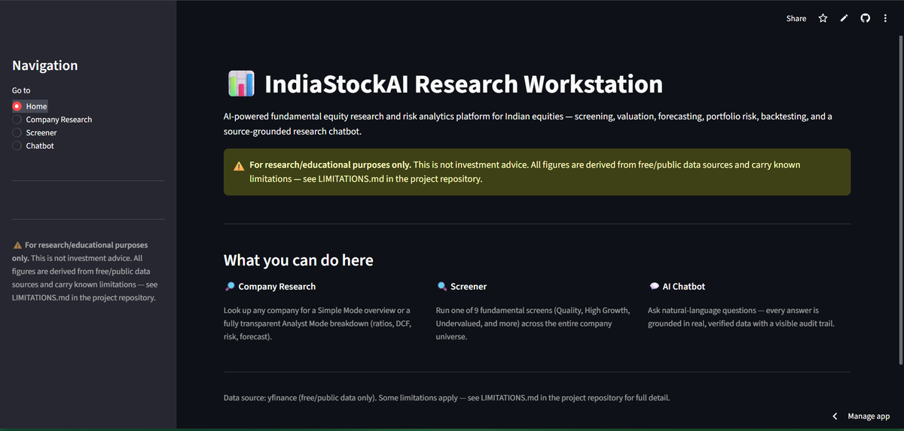
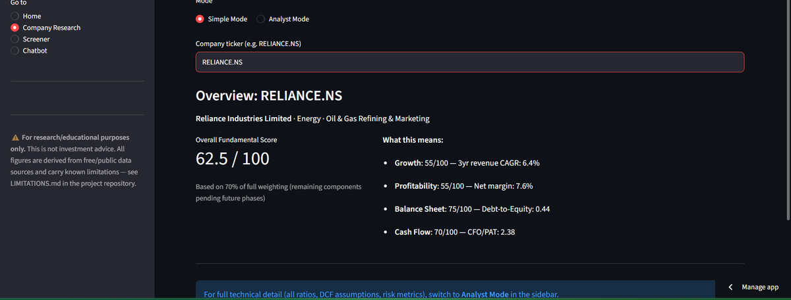
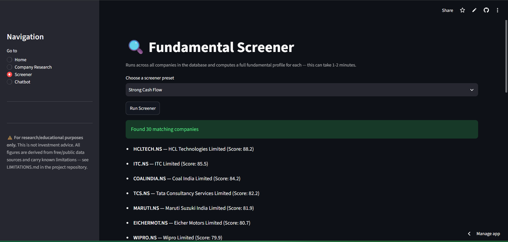
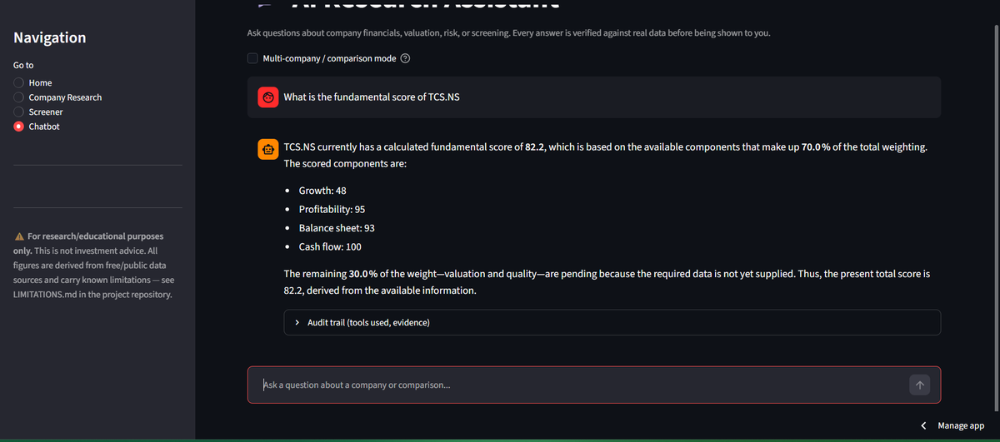
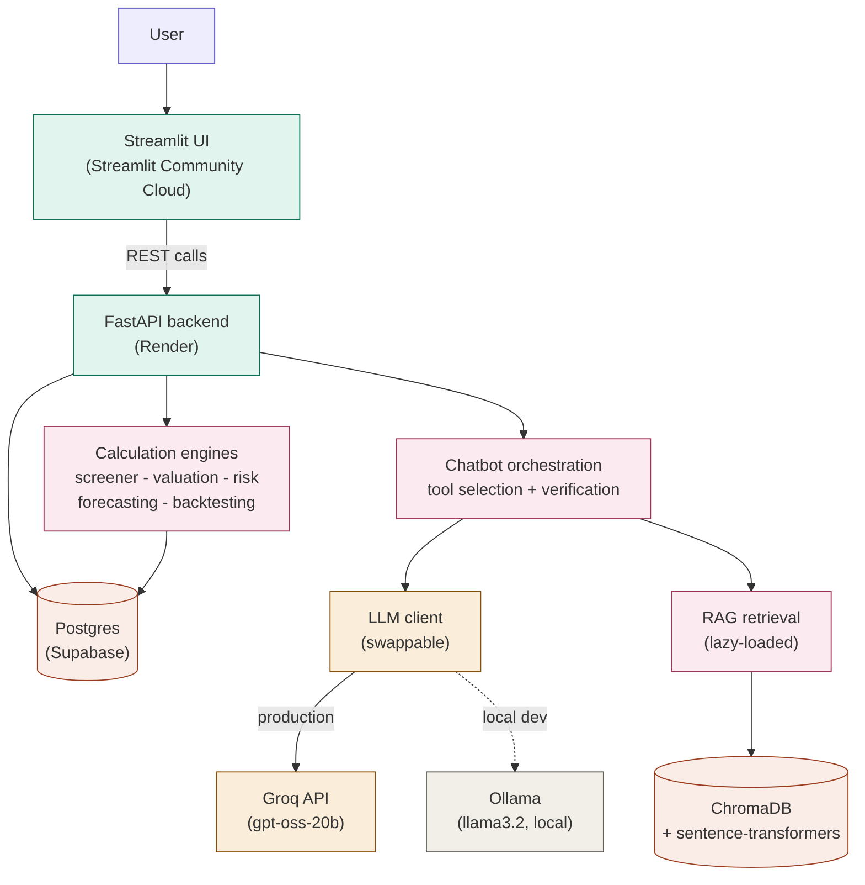

# IndiaStockAI Research Workstation

AI-powered fundamental equity research and risk analytics platform for Indian equities - screening, valuation, forecasting, portfolio risk, backtesting, and a source-grounded research chatbot.

**Live demo:** [indiastockai-research.streamlit.app](https://indiastockai-research-ih6qvntjggs3anu9ufpzvk.streamlit.app)
**API:** [indiastockai-api.onrender.com](https://indiastockai-api.onrender.com)

> WARNING: For research/educational purposes only. This is not investment advice. All figures are derived from free/public data sources and carry known limitations - see LIMITATIONS.md.

---

## What it does

| Feature | Description |
|---|---|
| Company Research | Simple Mode overview or full Analyst Mode breakdown (ratios, DCF, DDM, risk, forecast) for any NSE-listed company |
| Screener | 9 fundamental screens (Quality, High Growth, Undervalued, and more) run across the entire company universe |
| Forecasting | Bear / Base / Bull financial projections with configurable horizon |
| Valuation | DCF, DDM, and relative (peer-multiple) valuation, cross-checked against each other |
| Risk Analytics | Beta, annualized volatility, Sharpe, Sortino, max drawdown, historical VaR/CVaR |
| Backtesting | Fundamentals-based portfolio backtests with rebalancing |
| Document RAG | Semantic search over ingested research PDFs with page-level citations |
| AI Chatbot | Natural-language Q&A across every feature above - every numeric claim is verified against real data before being shown, with a visible audit trail |

## Screenshots

**Home**


**Company Research** (Simple Mode)


**Fundamental Screener**


**AI Chatbot**


## Architecture



The chatbot's LLM backend is swappable at runtime via an LLM_PROVIDER environment variable - Ollama for zero-cost local development, Groq's free tier for the public deployment (where a persistent local LLM process isn't available on free hosting).

## Tech stack

- **Backend:** FastAPI, SQLAlchemy, Python 3.12
- **Frontend:** Streamlit
- **Database:** PostgreSQL (Supabase)
- **Data source:** yfinance (free/public market data)
- **LLM orchestration:** LangGraph (multi-tool agentic planning), Groq / Ollama (swappable)
- **RAG:** ChromaDB + sentence-transformers (all-MiniLM-L6-v2)
- **Testing:** pytest (197 tests)
- **Containerization:** Docker, docker-compose
- **Deployment:** Render (API), Streamlit Community Cloud (UI)

## Engineering highlights

A few things worth calling out from building and deploying this:

- **Numeric verification guardrail** - every chatbot answer is checked digit-by-digit against the real source data before being shown. If the LLM's phrasing introduces any mismatch, the response falls back to raw verified figures rather than risking a wrong number reaching the user.
- **Swappable LLM provider** - a single llm_client.py abstraction lets the chatbot run entirely offline with Ollama locally, or on Groq's free-tier API in production, with no changes to the calling code.
- **Lazy-loaded RAG imports** - moving the ChromaDB/sentence-transformers import inside the one function that uses it (rather than at module load) dropped the API's startup memory footprint enough to run within Render's free-tier 512MB limit.
- **IPv6-aware database connection** - Supabase's direct connection string intermittently resolved to an IPv6 address unreachable from the deployment environment; switched to Supabase's Session Pooler (IPv4) to resolve it without any Docker-level network workarounds.


## Project structure

```text
app/
├── data/           # Providers, validators, SQLAlchemy models
├── screener/       # Fundamental screening presets
├── analysis/       # Peer comparison, earnings quality, business profile
├── forecasting/    # Bear/Base/Bull projections
├── valuation/      # DCF, DDM, relative valuation
├── risk/           # Beta, volatility, Sharpe/Sortino, VaR/CVaR
├── backtesting/    # Portfolio backtest engine
├── rag/            # Document chunking, embedding, retrieval
├── chatbot/        # Tool registry, orchestration, verification, LLM client
├── api/            # FastAPI routers
└── ui/             # Streamlit app

tests/              # Test suite
docker/             # Dockerfiles for API and UI
```

## Running locally

### 1. Clone the repository

```bash
git clone https://github.com/Soumya44444/indiastockai-research.git
cd indiastockai-research
```

### 2. Create and activate a virtual environment

**Windows PowerShell:**

```powershell
python -m venv venv
venv\Scripts\Activate.ps1
```

### 3. Install dependencies

```bash
pip install -r requirements.txt
```

### 4. Configure environment variables

```powershell
Copy-Item .env.example .env
```

Edit `.env` and add the required configuration values.

### 5. Install the local LLM

If using Ollama:

```bash
ollama pull llama3.2
```

### 6. Start the application with Docker

```bash
docker compose up --build
```

### Application URLs

* **API:** http://localhost:8000
* **API documentation:** http://localhost:8000/docs
* **UI:** http://localhost:8501

